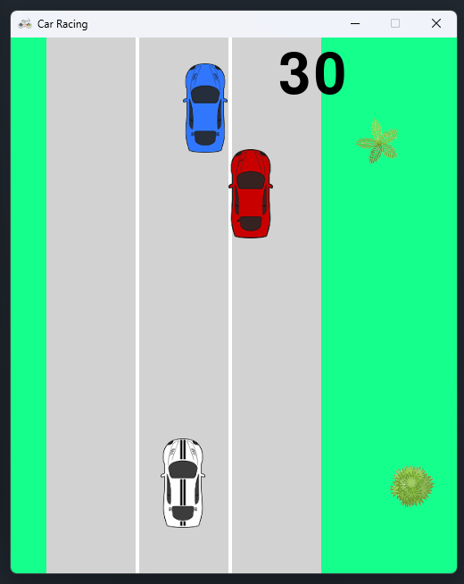

# 🏎️ Car Racing

🚗 **A car racing game inspired by the classic Top Gear, developed in Python using Pygame!**

## 📌 About the Project

This game was created during my college years as a **tribute to the legendary Top Gear**. Fully developed in **Python with Pygame**, it explores concepts of **2D graphics, simple physics for crashes**.

## 🎮 Features

✅ Classic racing with cars inspired by the original game
✅ Top Gear soundtrack
✅ Gamification with points


## 🛠️ Technologies Used

- **Language:** Python 🐍  
- **Graphics Library:** Pygame 🎮  

## 🚀 How to Play

1. **Clone the repository:**  
   ```bash
   git clone https://github.com/Samuelmvf/Pygame-TopGear-.git
   cd Pygame-TopGear-
   ```  
2. **Install Pygame:**  
   ```bash
   pip install pygame
   ```  
3. **Run the game:**  
   ```bash
   python topgear.py
   ```  

## 📷 Screenshots



## 📜 License

This project was created for educational and nostalgic purposes. Feel free to contribute or improve it! 🚗💨  

📌 Pinned Fun Memory from College
